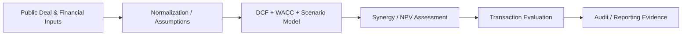

# M&A Valuation Decision Framework — Architecture

## Design controls

The repository separates source inputs, analytical/application logic and reporting outputs. Assumptions and transformations should remain reproducible; generated outputs should not be treated as source data.

## Production evolution

A production implementation would add authenticated access, environment-specific configuration, automated validation, CI quality gates, durable database migrations, observability and formal data-governance controls appropriate to the use case.
